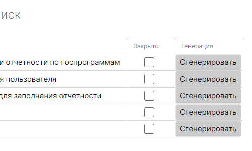
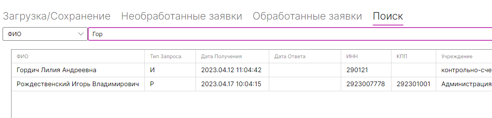

# Обработчик заявок на C#

Приложение, разработаное в рамках тестирования.  
В рамках разработки я попытался придерживаться архитектуры MVVM.

---

## Задача/реализация

#### Парсинг документов

Механически загрузка реализована как по кнопке, так и переносом файла в специальное поле.  
Все заявки парсятся в объекты, параметры которых соответствуют полям в тестовом xlsx файле.  
В приложении предусмотрена загрузка файлов двух форматов:
- xml
- xlsx

---

#### Пометка обработанных заявок  

Необработанные и обработанные заявки находятся в соответствующих вкладках. Чтобы заявка считалась обработанной, нужно нажать на чекбокс в строке соответствующей заявки. 

После чего она переместится в соответствующую вкладку и поле даты обработки будет автоматически заполнено текущим временем и датой.

---

#### Проверка полей на корректные значения

Проверка полей реализована на стороне view, проверяемые параметры:
- КПП
- ИНН
- Даты
- Номер телефона
- Электронная почта

Также, если какое-либо проверяемое поле заполнено неверно изначально - программа не даст "обработать" заявку, пока все неправильные поля не будут исправлены.

---

#### Возможность генерации паролей/логинов

Реализована возможность генерации пароля и логина для каждой отдельной заявки по нажатию кнопки в строке с данными заявки, рядом с чекбоксом для отметки об обработке.  
Также учитываются уже имеющиеся логины и пароли, программный модуль не сгенерирует пароли и логины, которые уже существуют в системе.  
Пароли не хешируются, т.к. в рамках тестовой работы это нецелесообразно.

---

#### Сохранение результатов работы

Данные можно сохранить в двух форматах:
- xml
- xlsx

В случае с xml, создаются два отдельных файла, один с обработанными заявками, другой нет.  
В случае с xlsx, генерируется один файл с двумя страницами, первая для необработанных заявок вторая для для обработанных заявок.

---

#### Поиск заявок

В приложении реализован поиск по всем параметрам заявок. В таблице с искомыми заявками также можно изменить статус обработки и сгенерировать пароли.

---

#### Обработка исключений

В приложении предусмотрена обработка критических исключений, потому неожиданно прекращать работу оно не должно.

---

## Дополнительные библиотеки

- Для разработки UI - Avalonia и дополнение для работы с таблицами
- Аддон для Avalonia, добавляющий функции всплывающих окон
- Для работы с xlsx файлами - EPPlus 4

---

## P.S.

*Все совпадения данных с данными реальных людей на скриншотах - случайны.
